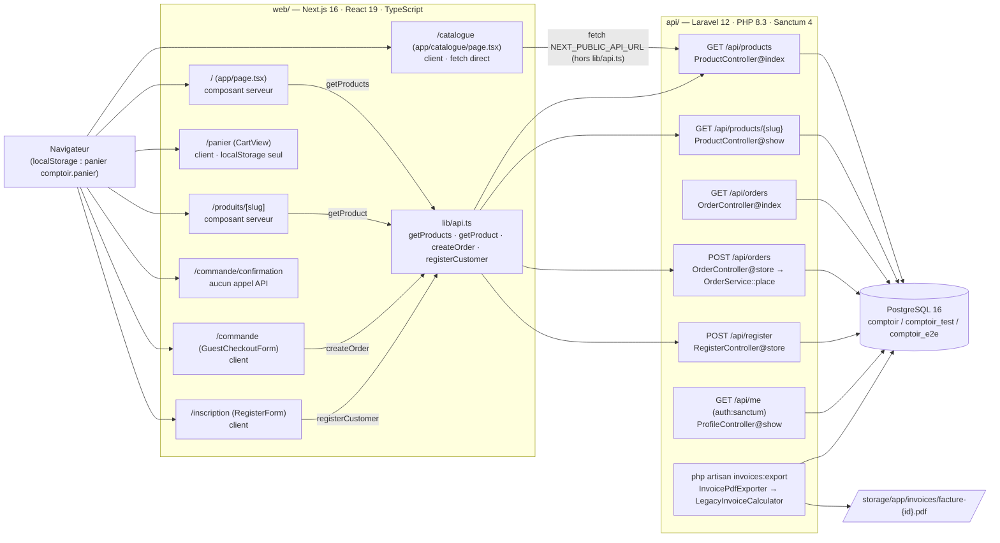
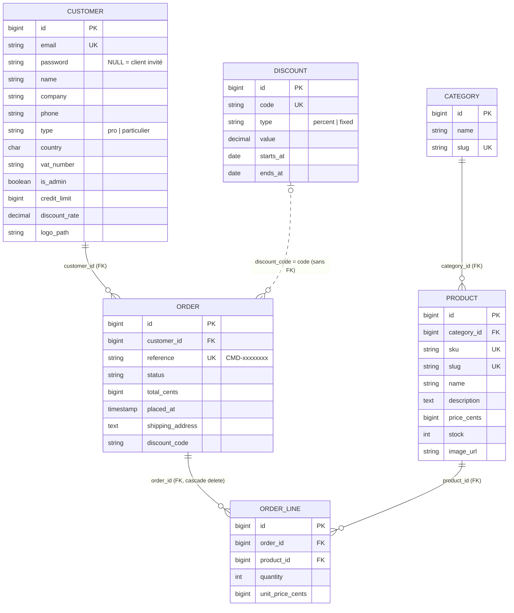
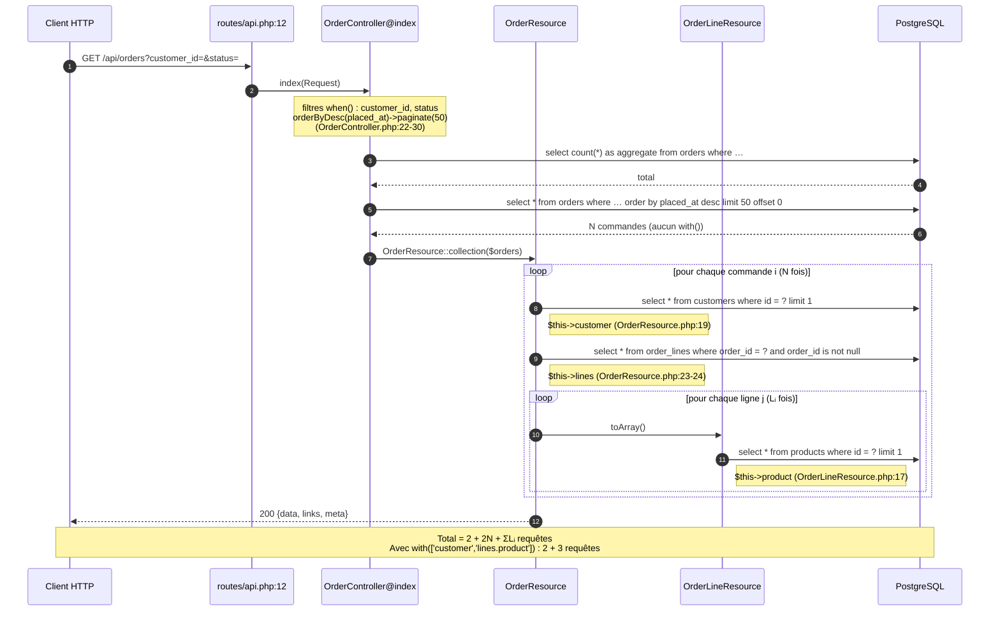

# Architecture de Comptoir

Document rédigé à partir de la lecture du code (`api/`, `web/`). Quand un élément est
déduit plutôt que lu, il est marqué **(supposé)**.

## 1. Vue d'ensemble

Remarques :

- `GET /api/orders` et `GET /api/me` ne sont appelés par aucune page de `web/` (aucune occurrence dans `web/app`, `web/components`, `web/lib`).
- `/` et `/produits/[slug]` sont des composants serveur : l'appel à l'API part du serveur Next.js (`API_URL`), pas du navigateur (`web/lib/api.ts:24-31`).
- `/catalogue` appelle l'API depuis le navigateur, sans passer par `lib/api.ts` (`web/app/catalogue/page.tsx:23`).

## 2. Modèle de données

| Relation | Déclarée dans le modèle | Contrainte en base |
|---|---|---|
| Category 1–N Product | `Category::products()` (`api/app/Models/Category.php:18`), `Product::category()` (`Product.php:33`) | FK `products.category_id` (`2024_05_12_000001_create_products_table.php:13`) |
| Customer 1–N Order | `Customer::orders()` (`Customer.php:38`), `Order::customer()` (`Order.php:53`) | FK `orders.customer_id` (`2024_05_12_000003_create_orders_table.php:13`) |
| Order 1–N OrderLine | `Order::lines()` (`Order.php:58`), `OrderLine::order()` (`OrderLine.php:30`) | FK `order_lines.order_id`, `cascadeOnDelete` (`2024_05_12_000004_create_order_lines_table.php:13`) |
| Product 1–N OrderLine | `Product::orderLines()` (`Product.php:38`), `OrderLine::product()` (`OrderLine.php:35`) | FK `order_lines.product_id` (`…_create_order_lines_table.php:14`) |
| Discount 1–N Order | `Discount::orders()` (`Discount.php:30`), `Order::discount()` (`Order.php:63`), par `discount_code` → `code` | **Aucune FK** : `orders.discount_code` est une simple chaîne (`…_create_orders_table.php:19`) |

Relations **non visibles dans le code** :

- aucune relation entre `Customer` et `Discount` (`customers.discount_rate` est un pourcentage stocké sur le client, sans lien avec la table `discounts`) ;
- aucune relation directe `Category` ↔ `OrderLine` ni `Customer` ↔ `Product` ;
- les relations `Order::discount()` et `Discount::orders()` ne sont utilisées nulle part dans `api/app` : `LegacyInvoiceCalculator` relit la table par `DB::table('discounts')` (`LegacyInvoiceCalculator.php:97`).

## 3. `GET /api/orders` : requêtes SQL pour N commandes

Notations : N = nombre de commandes de la page (au plus 50) et Lᵢ = nombre de lignes de la commande i.
Le texte SQL est celui que Laravel génère habituellement pour ces appels Eloquent **(supposé : non capturé par `DB::listen`)** ; l'ordre et le nombre des requêtes découlent du code lu.

Exemple : 50 commandes de 3 lignes chacune donnent 2 + 2×50 + 150 = 252 requêtes.

## 4. Points fragiles

| Zone | Constat | Risque |
|---|---|---|
| Performance · `GET /api/orders` | Aucun chargement anticipé (`OrderController.php:22-30`) alors que les resources lisent `customer`, `lines` et `lines.product` (`OrderResource.php:19,23-24`, `OrderLineResource.php:17`) | 2 + 2N + ΣLᵢ requêtes par page ; temps de réponse proportionnel au volume |
| Performance · schéma | Pas d'index sur `orders.customer_id`, `status`, `placed_at` (`2024_05_12_000003_create_orders_table.php:13,15,17`) ; `order_lines` en a (`…_create_order_lines_table.php:13-14`) | Parcours complet de `orders` pour filtrer et trier **(supposé : PostgreSQL ne crée pas d'index pour une FK)** |
| Performance · export facture | `line->product->category` sans préchargement (`InvoicePdfExporter.php:27-30`) | 2 requêtes par ligne de facture |
| Sécurité · commandes | `GET` et `POST /api/orders` publics (`routes/api.php:12-13`) ; `customer_id` libre (`StoreOrderRequest.php:17`) | Lecture des commandes de tous les clients ; commande passée au nom d'un autre client |
| Sécurité · invité | Un invité existant est réutilisé sur simple e-mail (`OrderService.php:82-84`) | Rattachement de commandes à un tiers ; nom et société envoyés ignorés |
| Stock | Contrôle puis décrément ligne par ligne, sans regrouper les doublons de `product_id` (`OrderService.php:29-35,56`) | Deux lignes du même produit peuvent dépasser le stock ; stock négatif **(supposé : `unsignedInteger` n'est pas appliqué par PostgreSQL)** |
| Référence commande | Vérification `exists()` puis insertion, sans verrou (`Order.php:44-49`) | Collision rare entre deux requêtes simultanées, donc erreur 500 sur la contrainte `unique` |
| Montants · remise quantité | `>= 10` est testé avant `>= 50` (`LegacyInvoiceCalculator.php:50-53`) | Remise de 10 % jamais appliquée (vérifié en exécutant le calcul : 50 × 10 € donne 475, pas 450) |
| Montants · flottants | Euros en `float` : `unit_price_cents / 100` (`InvoicePdfExporter.php:31`), calculs et arrondis successifs (`LegacyInvoiceCalculator.php:48,55,92,102,132,142`), `toCents` jamais utilisé (`:344`) | Écarts d'un centime, contraire à la convention « centimes entiers » |
| Montants · TVA | Remise répartie au prorata puis arrondi par taux (`LegacyInvoiceCalculator.php:128-135`) | Somme des TVA différente d'un calcul global **(supposé)** |
| Montants · pays UE | Liste UE incomplète (`LegacyInvoiceCalculator.php:42`), différente de `isEuCountry` qui contient GB (`:243`) | Client PL, SE, DK… facturé comme hors UE : TVA à 0 et port à 25 € |
| Montants · code promo | `discount_code` stocké (`OrderService.php:42`) sans être appliqué à `total_cents` (`:58,61`) ni validé (`StoreOrderRequest.php:27`) | `total_cents` en base différent du total facturé ; codes inexistants acceptés |
| Calculateur · état | `public $lastResult` lu par l'export au lieu de la valeur de retour (`LegacyInvoiceCalculator.php:21`, `InvoicePdfExporter.php:37`) | Résultat d'un calcul précédent réutilisé si l'instance est partagée |
| Facture | Texte brut entouré de `%PDF-1.4` / `%%EOF` (`InvoicePdfExporter.php:39-67`) | Fichier non lisible par un lecteur PDF **(supposé)** |
| Web · catalogue | `fetch` direct sans `catch` ni `response.ok` (`web/app/catalogue/page.tsx:22-29`) ; prix via `toFixed(2)` (`:53`) au lieu de `formatPrice` (`web/lib/money.ts:6`) | Page bloquée sur « Chargement… » en cas d'erreur ; prix « 12.50 € » au lieu de « 12,50 € » |
| Web · panier | JSON du `localStorage` casté sans validation (`web/lib/cart.ts:51`) | Panier corrompu affiché tel quel ; le serveur recalcule bien le total |
| Tests | Aucun test de `LegacyInvoiceCalculator`, `InvoicePdfExporter`, `ExportInvoice` (`api/tests/Unit` ne contient que `ExampleTest.php`) ; `discount_code` et les doublons non testés (`api/tests/Feature/OrderTest.php`) | Régressions de facturation non détectées |
| CI | Seuls Pint, ESLint et `tsc` tournent (`.github/workflows/lint.yml:30-55`) | Pest, Vitest et Playwright jamais exécutés automatiquement |
| Conventions | Aucun `declare(strict_types=1)` dans `api/app` | Conversions de types implicites, notamment sur les montants |
